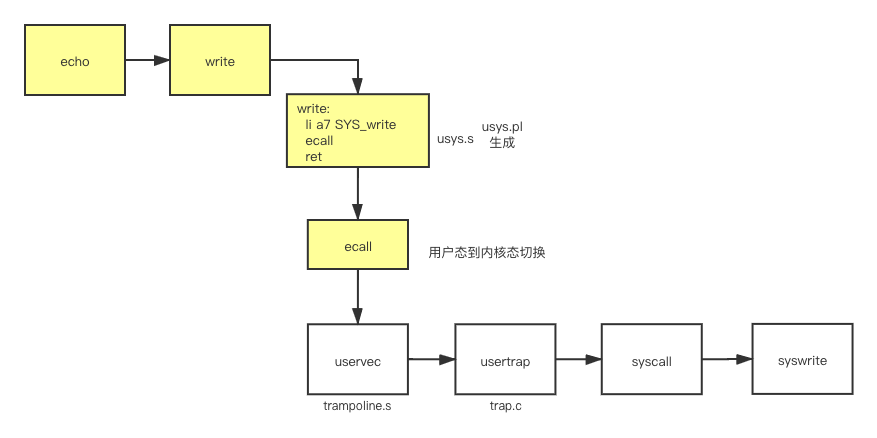

> 这一章介绍了xv6里面，用户态到内核态的转换过程。\
> 此note包含两部分：xv6转换机制和linux转换机制

# xv6
在xv6里面，执行syscall、中断、page fault等错误时，需要将控制权移交给内核进行处理。这个处理过程即为trap。

## trap机制

### trap代码执行过程
以`write`调用为例，大概的流程为，用户态进程调用内核的`write`，触发`ecall`指令，切换到内核态，执行内核态的wirte。



### ecall之前

echo调用write时，实际上关联到`usys.s`中的函数。（注：这个文件由`usys.pl`生成）

```
write:
    li a7, SYS_write
    ecall
    ret
```
ecall走到trampoline page的，而ecall实际上只会改变三件事情：
- 第一，ecall将代码从user mode改到supervisor mode。
- 第二，ecall将程序计数器的值保存在了SEPC寄存器。
- 第三，ecall会跳转到STVEC寄存器指向的指令

### ecall之后
ecall帮我们做了一点点工作，但是实际上我们离执行内核中的C代码还差的很远。接下来：
- 需要保存32个用户寄存器的内容，这样当我们想要恢复用户代码执行时，我们才能恢复这些寄存器的内容。
- 因为现在我们还在user page table，我们需要切换到kernel page table。
- 我们需要创建或者找到一个kernel stack，并将Stack Pointer寄存器的内容指向那个kernel stack。这样才能给C代码提供栈。
- 我们还需要跳转到内核中C代码的某些合理的位置。


### uservec

ecall，之后，程序会跳转到trampoline.s中的 uservec 函数。在 uservec 函数中完成了用户态程序寄存器的保存、页表切换、kernelstack以及程序跳转的工作。

### usertrap

跳转到trap函数中后，根据rscause() 函数，得到进入 trap 的原因，（此处为syscall），然后使能中断，调用 syscall

### syscall

syscall中，从寄存器中读取syscall的编码，调用函数。并把返回值保存在a0寄存器中。

### usertrapret
调用结束后，返回。需要用到 usertrapret。首先关闭中断（避免乱七八糟的问题，用户态内核态切换时需要关闭中断）。


### userret
kernel/trampoline.S 中返回用户态。